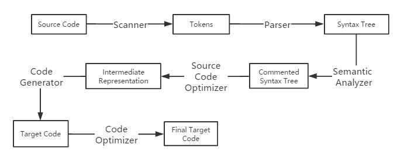
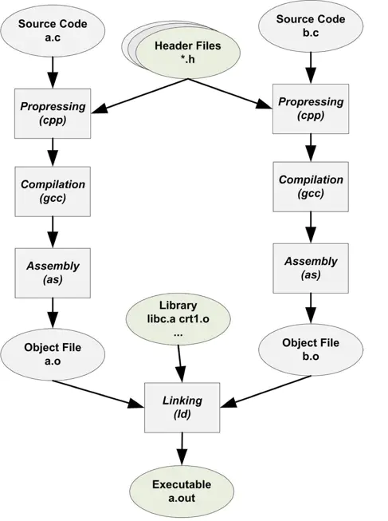

# 编译原理

## 1.编译和链接

### 1.1简介

```c
#include <stdio.h>

int main()
{
    printf("hello world\n");
    return 0;
}
```

在Linux下，当我们使用`gcc`来编译的`hello.c`的时候，只需要简单的命令。

```c
$ gcc hello.c
$ ./a.out
hello world
```

在编译的过程中，事实上可以划分为四个步骤：预处理（`Prepressing`）、编译（`Compilation`）、汇编（`Assembly`）和链接（`Linking`）。


<center>GCC编译hello world程序过程分解</center>

### 1.2预编译

首先是源代码文件`hello.c`和相关的头文件(`stdio.h`等)被预编译器`cpp`预编译成一个`.i`文件。

预编译过程中主要处理了源代码文件中的以`#`开头的预编译指令。例如`#include`，`#define`等。

- 将所有的`#define`删除，并且展开所有的宏定义。
- 处理所有条件预编译指令，例如`#if`，`#ifdef`，`#elif`，`#else`，`#endif`。
- 处理#include预编译指令，将包含的文件插入到该预编译指令的位置。**整个过程是递归进行的，这也意味着被包含的文件可能还包含其他头文件。**
- 删除所有的注释`//`和`/* */`。
- 添加行号和文件名标识，以便于编译时编译器产生调用的行号信息，在编译产生编译错误或者警告时能够显示行号。
- 保留所有的`#pragma`编译指令。

在经过预编译后的`.i`文件不包含任何宏定义（所有宏已经被展开，包含的头文件也已经被插入到.i文件中），所以在我们无法判断宏定义是否正确或者头文件是否正确时，可以通过查看预编译后的.i文件来确定问题。

### 1.3编译

编译过程就是对已预处理的文件进行**词法分析、语法分析、语义分析并优化后生成相应的汇编代码文件**。

### 1.4汇编

汇编器将汇编代码转变成机器可以执行的指令，每一个汇编语句几乎都对应一条机器指令。**在经历过预编译，编译和汇编后就可以直接输出目标文件。**

### 1.5链接

在一个目标文件中，不可能所有变量和函数都定义在同一个文件内部。不同文件之间要做相应的链接处理。

## 2.编译器做了什么

编译过程一般可以分为6个步骤：**扫描、语法分析、语义分析、源代码优化、代码生成和目标代码优化**。



<center>编译过程</center>

### 2.1词法分析

首先源代码被输入到**扫描器(Scanner)**，通过一种类似于**有限状态机(Finite State Machine)**的算法进行词法分析，将源代码的字符序列分割成一系列的**记号(Token)**.

词法分析产生的记号一般可以分成4类：

1. 关键字
2. 标识符
3. 字面量(包含数字、字符串等)
4. 特殊符号(如加号、等号)

在识别记号的同时，扫描器也完成了其他工作。例如：将标识符存放到符号表，将数字、字符串常量存放到文字表等，以备后面步骤使用。

### 2.2语法分析

接下来**语法分析器(Grammar Parser)**将对有扫描器产生的记号进行语法分析，从而产生**语法树(Syntax Tree)**。整个分析过程采用了**上下文无关语法(context free grammar)**。

简单的讲，由语法分析器生成的语法树就是以**表达式(Expression)**为节点的树。

```c
int fun(int a, int b) {
    int c = 0;
    c = a + b;
    return c;
}
```

以如上代码为例，它的语法树形式如下：


语法树将字符串格式的源代码转化为树状的数据结构，更容易被计算机理解和处理。

对于不同的编程语言，编译器开发者只需要改变语法规则，不需要为每个编译器重新写一个语法分析器，所以它又被称为**编译器编译器(Compiler Compiler)**。

### 2.3语义分析

语义分析是由**语义分析器(Semantic Analyzer)**来完成的。

语义分析之前的语法分析仅仅只是完成了对表达式的语法层面的分析，但是它并不了解这个语句是否真正有意义。例如：在C语言里面两个指针做乘法运算是没有意义的，但是这个语句在语法上是合法的。

在编译器中进行的语义分析是**静态语义分析(Static Semantic)**。静态予以是指在编译期可以确定的语义，与之对应的**动态语义(Dynamic Semantic)**就是只有在运行期才能确定的语义。

静态语义通常包括**声明、类型的匹配和类型的转换**等。例如一个浮点型的表达式赋值给一个整型的表达式时，其中就隐含了一个浮点数到整型转换的过程，语义分析过程中需要完成这个步骤。动态语义一般指在运行期出现的语义相关的问题，例如将0作为除数是一个运行期语义错误。

经过语义分析之后，在语法分析生成的语法树的基础上进一步对表达式做一些标识。例如：有些某些类型需要做隐式转化，语义分析器会在之前的语法树中插入相应的转换节点。

### 2.4中间语言生成

**源码级优化器(Source Code Optimizer)**会在源代码级别进行优化。在不同编译器中可能会有不同的定义或有一些其他的差异。

因为直接在语法树上作优化比较困难，所以源代码优化器会将整个语法树转换成**中间代码(Intermediate Code)**，它是语法树的顺序表示。

中间代码有很多种类型，在不同编译器中有着不同的形式。而中间代码的存在使得编译器被分为**前端和后端**。其中编译器前端主要负责产生与机器无关的中间代码，编译器后端主要是将中间代码转换成目标机器代码。因为这意味着针对那些跨平台的编译器而言，可以针对不同的平台使用同一个前端和针对不同机器平台的多个后端。

### 2.5目标代码生成与优化

源码级优化器产生中间代码标志着下面的过程都属于编译器后端。编译器后端主要包括**代码生成器(Code Generator)和目标代码优化器(Target Code Optimizer)**。

代码生成器将中间代码转换成目标机器代码，这个过程依赖于目标机器，因为不同的机器有不同的字长、寄存器、整数数据类型、浮点数数据类型等。

最后目标代码优化器对上述的目标代码进行优化，例如选择合适的寻址方式、使用位移来代替乘法运算、删除多余的指令等。

### 2.6链接

链接的主要内容 ： 把各个模块之间相互引用的部分都处理好，使得各个模块之间能够正确地链接。

链接过程主要包括：

1. **地址和空间分配(Address and Storage Allocation)**

2. **符号决议(Symbol Resolution)**,有时也被称为**符号绑定(Symbol Binding)**,决议更倾向于静态链接，绑定更倾向于动态链接。

3. **重定位(Relocation)**

   

<center>链接的过程</center>

最基本的静态链接如图所示，每个模块的源代码文件经过编译器编译成**目标文件(Object File,一般扩展名.o或者.obj)**，目标文件和**库(Library)**一起链接形成最终的可执行文件。最常见的库就是**运行库(Runtime Library)**,它是支持程序运行的基本函数的集合。

让我们来看看什么是重定位。假设有个全局变量叫做 var ，它在目标文件A里面。我们在目标文件B里面要访问这个全局变量。由于在编译目标文件B的时候，编译器并不知道变量var的目标地址，所以编译器在没法确定的情况下，将目标地址设置为0，等待链接器在目标文件A和B连接起来的时候将其修正。这个地址修正的过程被叫做**重定位**，每个被修正的地方叫一个**重定位入口**。

链接器就是靠着重定位表来知道哪些地方需要被重定位的。每个可能存在重定位的段都会有对应的重定位表。在链接阶段，链接器会根据重定位表中，需要重定位的内容，去别的目标文件中找到地址并进行重定位。

## 3.目标文件

### 3.1.简介

编译器编译源代码生成的文件叫做目标文件。 从结构上说，是编译后的可执行文件，只不过还没有经过链接  。

### 3.2目标文件的格式 

- 可执行文件的格式： Windows下的PE 和  Linux下的ELF 
- 从广义上说，目标文件与可执行文件的格式几乎是一样的，所以广义上可以将目标文件与可执行文件看成是一种类型的文件。
- 可执行文件，动态链接库，静态链接库都按照可执行文件格式存储（Windows下是 PE-COFF格式，Linux下是ELF格式）

在Linux下可以通过`$: file 文件名`显示出对应文件的类型。

### 3.3目标文件是什么样子的

目标文件包含的内容：编译后的机器指令代码、数据，还有链接时要的一些信息（比如符号表、调试信息、字符串等）。

一般目标文件把上述信息按不同的属性，以节（section）的形式存储，有时也叫段（segment）。

*程序源代码编译后的机器指令*  常放在**代码段(Code Section)**,代码段常见的名字“.code”、“.text”
*已初始化全局变量和局部静态变量数据*  常放这**数据段(Data Section)**,数据段常见的名字“.data”


<center>程序被编译成目标文件后的结构</center>

注意 文件头还有一个**段表（section table）**，段报表其实是一个描述文件中各个段的数组，描述各个段在文件中的偏移位置和属性等。

**总体来说：程序源代码被编译后主要分成两种段：程序指令（代码段）和程序数据（数据段，`bss`段）。**

为什么要将程序指令和数据分开放？

- 程序被装载之后，数据和指令分别被映射到两个虚存区域。数据区对进程来说可读写，但指令区对进程只可读。因此分开存放，可以防止程序的指令被改写。
- 现在的CPU有强大的**缓存（Cache）体系**，所以程序必须尽量提高缓存的命中率。指令和数据的分离有利于提高程序的局部性。CPU的缓存一般都被设计成数据缓存与指令缓存分离。
- 当系统运行多个该程序的副本时，它们的指令是一样的，因此内存中只需要保存一份该程序的指令部分。共享指令，可以节省大量的内存。

### 3.4挖掘**`Simplesection.o`**

`objdump` 查看各种目标文件的结构和内容， `objdump –h Simplesection.o` 其中 -h 表示把ELF文件的各个段的基本信息打出来。

`readelf` 专门针对ELF文件格式的解析器

 size 可以用来查看ELF文件的代码段、数据段和`bss`段的长度  `size Simplesection.o`

**代码段**

`objdump` 的参数 –s 将所有的段的内容以十六进制的方式打印出来 

​          -d 将所有包含指令的段反汇编  比如 `objdump –s –d main.o`

​          -h 把关键的段显示了出来，忽略了辅助性段

**数据段和只读数据段**

`.data`：保存的是已初始化全局变量和局部静态变量

`.rodata`：存放的是只读数据，一般是程序中的只读变量（如用`const`修饰的）和字符串常量。

**`BSS`段**

`BSS`段存放的是未初始化的全局变量和静态局部变量，不占磁盘空间。

**其他段**


### 3.5`ELF`文件结构

**文件头**

通过`readelf`命令可以详细查看`ELF`文件（`readelf –h Simplesection.o`）

`ELF`文件中定义了：`ELF`魔数、文件机器字节长度、数据存储方式、版本、运行平台、`ABI`版本、`ELF`重定位类型、硬件平台、硬件平台版本、入口地址、程序头入口和长度、段表的位置和长度及段的数量等。

ELF魔数：文件头最开始的4个字节是所有ELF都必须相同的标识码。又称为魔数。
魔数用来确认文件类型，操作系统在加载可执行文件的时候会确认魔数是否正确，若不正确则拒绝加载。

ELF文件类型：

1. 可重定位文件（Relocatable File）
2. 可执行文件（Executable File）
3. 共享目标文件（Shared Object File）
4. 核心转储文件（Core Dump File）

**段表**

描述了ELF各个段的信息（比如每个段的段名、段的长度、在文件中的偏移，读写权限及其他属性）。

编译器、链接器和装载器都是靠段表来定位和访问各个段的属性的。

可以通过`readelf –S Simplesection.o`显示真正的段表结构

上述结果是一个以 `ELF32_Shdr` 结构体为元素的数组。`ELF32_Shdr`又被称为**段描述符(Section Descriptor)**.

**重定位表**

一个叫`rel.text`的段，类型是`SHT_REL`，就是**重定位表（Relocation Table）**。

链接器在处理目标文件时，需要对目标文件中的某些部位进行重定位（即代码段和数据段中那些对绝对地址的引用的位置）。

这些重定位信息都记录在ELF文件的重定位表里。对于每个需要重定位的代码段或数据段，都会有一个相应的重定位表。

**字符串表**

把ELF文件中用到的字符串（段名、变量名等）集中起来存放到一个表中。然后使用字符串在表中的偏移来引用字符串。这个表就是字符串表。

一般字符串表在ELF文件中也以段的形式保存。常见的段名有`.strtab`， `.shstrtab`.

- `.strtab`：字符串表，保存普通的字符串。
- `.shstrtab`：段表字符串表，保存段表中用到的字符串，最常见的就是段名。

只有分析ELF文件头，就可以得到段表和段表字符串表的位置，从而解析整个ELF文件。

### 3.6链接的接口-符号

链接过程的本质就是要把多个不同的目标文件之间相互粘滞到一起。

为了使不同目标文件之间能够相互粘合，这些目标文件必须要有固定的规则才行。

在链接中，目标文件之间相互拼合实际上是目标文件之间对地址的引用，即对函数和变量的地址的引用。

在链接中，我们将函数和变量统称为符号（symbol），函数名或变量名就是符号名（symbol name）。

每一个目标文件都会有一个相应的符号表（symbol table），记录着目标文件中所用到的所有的符号。

每个定义的符号有一个对应的值叫做符号值（symbol value）。对于变量或函数来说，符号值就是它们的地址。

符号的分类：

- 定义在本目标文件的全局符号，可被其他目标文件引用。
- 在本目标文件中引用的全局符号，却没有定义在本目标文件。一般叫做外部符号（external symbol）。
- 段名，这种符号往往由编译器产生，它的值就是该段的起始地址。
- 局部符号，这类符号只在编译单元内部可见。
- 行号信息，即目标文件指令与源代码中代码行的对应关系，是可选的。

最值得关注的就是全局符号，即第一类和第二类。

**ELF符号表结构**

ELF文件中的符号表往往是文件中的一个段，y一般叫做 `.symtab`，是一个`Elf32_Sym`结构(32位ELF文件)的数组，数组中每个元素对应一个符号。

**特殊符号**

使用`ld`链接器产生可执行文件时，会给我们定义很多符号（没有在自己的程序中定义），但是可以直接声明并且引用它，我们称之为特殊符号。

**符号修饰与函数签名**

c++增加了名称空间（`namespace`）的方法来解决多模块之间的符号冲突问题。

c++符号修饰 **函数签名（Function Signature）**：包含了一个函数的信息（函数名、参数类型、所在的类和名称空间和其他信息）。函数签名用于识别不同的函数。

**弱符号与强符号**

多个目标文件含有相同名字的全局符号的定义，在链接时将会出现符号重复定义的错误。

编译器默认函数和初始化了的全局变量为强符号，未初始化的全局变量为弱符号。

强弱符号都是针对定义来说的，不是针对符号的引用。 假如 `extern int ext; ext`不是强符号也不是弱符号，因为它是一个外部变量的引用。

链接器按下面规则处理与选择被多次定义的全局符号：

- 不允许强符号被多次定义，否则报错。
- 若一个符号在某个目标文件中是强符号，在其他文件中都是弱符号，那么选择强符号。
- 若一个符号早所有的目标文件中都是若符号，那么选择其中占用空间最大的那一个。

 

强引用：假如链接时没找到该符号的定义，链接器就会报符号未定义错误。

弱引用：假如链接时没找到该符号的定义，链接器不会报错，默认其为0或是一个特殊值。

### 3.7调试信息

在`gcc`编译时加上 `–g` 参数就会在产生的目标文件里面加上调试信息。  目标文件会多些 debug段。

假设有个目标文件 hello， Linux下可以用 `strip` 命令来去除调试信息， 用法： $ `strip hello`

## 4.静态链接

### 4.1前期准备

我们将使用下面这两个源代码文件`a.c`和`b.c`作为例子展开分析：

```c
//a.c
extern int shared;

int main()
{
    int a = 100;
    swap(&a, &shared);
}
```

```c
//b.c
int shared = 1;

void swap(int* a, int* b) {
    *a ^= *b ^= *a ^= *b;
}
```

编译源代码得到目标文件 `a.o` 和 `b.o`。

```
gcc -c a.c b.c -fno-stack-protector
```

编译源码到目标文件时，一定要加`-fno-stack-protector`，不然默认会调函数`__stack_chk_fail`进行栈相关检查，然后手动裸`ld`去链接，会没有链接到`__stack_chk_fail`所在库文件，所以在链接过程一定会报错: undefined reference to `__stack_chk_fail`。

链接 `a.o` 和 `b.o` 目标文件得到可执行文件

```c
ld a.o b.o -e main -o ab
```

